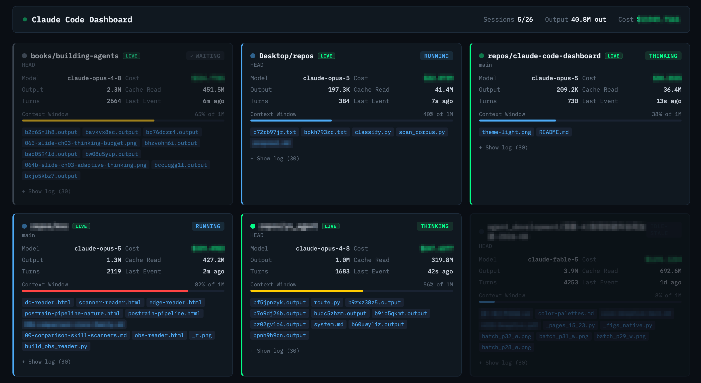

# ccdash

A localhost dashboard for running several Claude Code sessions at once. It answers one
question at a glance — **which session needs me right now** — and gets you there in one
click.



> Project names, filenames and dollar amounts are pixelated; everything else is a live capture.

## Why

Claude Code has no cross-session visibility. Running three or four sessions in separate
terminals means alt-tabbing to find out what each one is doing, no combined token or cost
view, and no way to tell a session that is working from one that has been sitting there
waiting for you since lunch.

## What it does

- **Status that reflects the conversation, not the clock** — `thinking`, `running`,
  `waiting`, `idle`, derived from where the exchange actually stopped
- **Click a session to jump to its terminal** — raises the window it is running in
  (iTerm2 and Terminal), or opens its folder when it is no longer running
- **Read marks** — a session you have already opened stops competing for attention until
  it actually moves
- **Resume a dead session in one click** — opens a new terminal in its working
  directory and picks the conversation up where it stopped
- **Token and cost tracking** — per-session and combined, with per-model pricing and
  correct cache accounting
- **Context window usage** — per-model, so the bar means something
- **Live subagent and background-job detection** — sessions doing delegated work read as
  `running` rather than idle
- **Click a file to open it** — ranked so the thing you asked for comes first. HTML is
  served by the dashboard with an explicit charset; everything else opens in whatever
  app owns the type
- **Search across every session** — by topic, project, path or branch, with the session
  titles as autocomplete
- **Git branch, permission mode**, and an expandable per-session log

## Quick start

```bash
git clone https://github.com/yangop8/ccdash.git
cd ccdash
npm install
npm start
```

Open **http://localhost:3001**. Run it in its own terminal tab; your Claude Code sessions
run wherever they normally do.

A second port, 3002 by default, serves HTML previews. It serves only the directories
holding files a session actually touched, and resolves symlinks on both sides before
comparing, so a preview cannot read the rest of the disk. It is also a separate origin on
purpose:
a deliverable is HTML a session wrote, and from the dashboard's own origin its scripts could read the
session API or trigger a resume as if they were the page itself.

## How it works

Claude Code writes JSONL session logs to `~/.claude/projects/`. ccdash watches them with
`chokidar`, parses newly appended lines, and serves aggregated state over Express to a page
that polls every 2 seconds. No WebSockets, no build step, no cloud.

Two things are read from outside those logs, because the logs do not contain them:

- **Liveness** comes from the process table. Claude Code does not hold its JSONL open, and
  the per-session directories under `/tmp` outlive the process by weeks, so a running
  `claude` process whose working directory matches the session's project is the only
  reliable signal.
- **The terminal window** comes from that process's controlling tty, matched against the
  terminal's own window list over AppleScript.

### Status model

| Status | Meaning |
|---|---|
| `thinking` | The agent owes a response — a prompt to answer, a tool result to digest, a tool still running |
| `running` | Delegated work is in flight: a shell older than 30s, a live workflow, or subagent traffic |
| `waiting` | The turn is finished and the process is alive — it is blocked on you |
| `idle` | The process is gone |

Only an assistant message that says something and calls nothing hands control back, so
that is the one shape that produces `waiting`. Elapsed time is not used: measured gaps
between a prompt and the first assistant event run past 25 seconds, and any timeout short
enough to be useful mislabels a working agent as done.

**Known gap:** permission prompts are never written to the JSONL, so an unanswered one is
indistinguishable from a running tool and reads as `thinking`. Tools that block on a human
by name — `AskUserQuestion`, `ExitPlanMode` — are detected and read as `waiting`.

A slash command leaves four user events behind — the typed line, a caveat, an echo, and
its stdout. Only the stdout carries meaning for status: the command ran and control is
back with you. Without that distinction a finished `/compact` reads as a prompt still
awaiting an answer.

## Requirements

- **Node.js** v20.19+ (what chokidar 5 requires)
- **Claude Code**
- **macOS** for the click-to-jump feature (iTerm2 or Terminal). Everything else is
  cross-platform; on other terminals and platforms a click opens the session folder.

## Configuration

```bash
PORT=8080 npm start
```

Pricing and context windows live at the top of `watcher.js`. Both are per-model — update
them when Anthropic's rates change:

```js
const PRICING = {
  'claude-opus-5': { input: 5.00, output: 25.00 },  // USD per 1M tokens
  // ...
};
```

Cache tokens are billed separately: writes at 1.25x the input rate, reads at 0.1x.

### Auto-start

A macOS LaunchAgent works. `RunAtLoad` starts it at login and `KeepAlive` with
`SuccessfulExit: false` restarts it if it dies:

```bash
launchctl bootstrap gui/$(id -u) ~/Library/LaunchAgents/com.you.ccdash.plist
launchctl kickstart -k gui/$(id -u) com.you.ccdash   # after editing watcher.js
```

**If the checkout is under `~/Desktop`, `~/Documents`, or `~/Downloads`**, the agent may
hang at startup instead of running: those folders are TCC-protected, and Node walks up the
directory tree looking for `package.json` before executing a line of your code. A
background agent cannot show the permission prompt that would unblock it, so it waits in
`open()` forever — the process is alive, at 0% CPU, with an empty log and nothing
listening. Either keep the checkout somewhere else, or grant the node binary access to
that folder before installing the agent.

## Tech stack

Node.js, Express, chokidar. Single HTML file, React via CDN, no build step. Two production
dependencies.

## Credits

Built on [claude-code-dashboard](https://github.com/Stargx/claude-code-dashboard) by Cold
Beam Games, which established the watcher/API/polling-page architecture and the terminal
aesthetic. ccdash is an independent continuation: it adds the terminal jump, rewrites
status derivation, adds read marks, and corrects context-window and cost accounting.

## License

MIT — see [LICENSE](LICENSE). The original copyright notice is retained.
